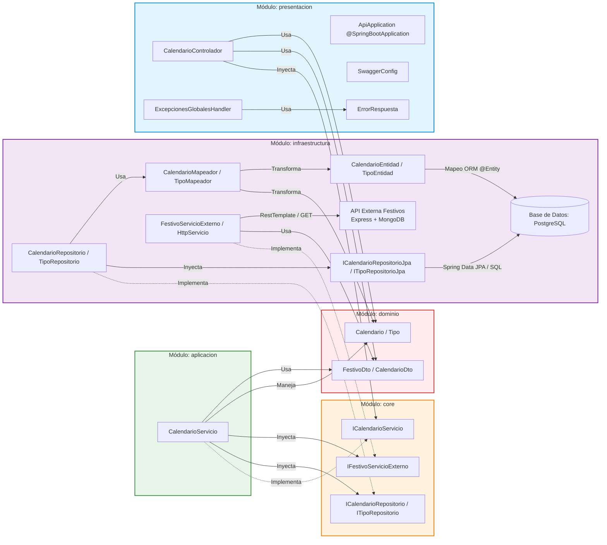

```mermaid
graph LR
    %% Módulo Dominio
    subgraph Dominio [Módulo: dominio]
        Entidades[Calendario / Tipo]
        DTOs[FestivoDto / CalendarioDto]
    end

    %% Módulo Core
    subgraph Core [Módulo: core]
        InterfacesServicio[ICalendarioServicio]
        InterfacesRepo[ICalendarioRepositorio / ITipoRepositorio]
        InterfacesIntegracion[IFestivoServicioExterno]
    end

    %% Módulo Aplicación
    subgraph Aplicacion [Módulo: aplicacion]
        ServiciosApp[CalendarioServicio]
    end

    %% Módulo Infraestructura
    subgraph Infraestructura [Módulo: infraestructura]
        RepositoriosImpl[CalendarioRepositorio / TipoRepositorio]
        RepositoriosJPA[ICalendarioRepositorioJpa / ITipoRepositorioJpa]
        EntidadesJPA[CalendarioEntidad / TipoEntidad]
        Mapeadores[CalendarioMapeador / TipoMapeador]
        IntegracionExt[FestivoServicioExterno / HttpServicio]
        DB[(Base de Datos: PostgreSQL)]
        APIExterna[API Externa Festivos<br/>Express + MongoDB]
    end

    %% Módulo Presentación
    subgraph Presentacion [Módulo: presentacion]
        ApiApp[ApiApplication @SpringBootApplication]
        Controladores[CalendarioControlador]
        Configuracion[SwaggerConfig]
        Handlers[ExcepcionesGlobalesHandler]
        DtosPresentacion[ErrorRespuesta]
    end

    %% Relaciones Aplicación -> Core / Dominio
    ServiciosApp -.->|Implementa| InterfacesServicio
    ServiciosApp -->|Inyecta| InterfacesRepo
    ServiciosApp -->|Inyecta| InterfacesIntegracion
    ServiciosApp -->|Maneja| Entidades
    ServiciosApp -->|Usa| DTOs

    %% Relaciones Infraestructura -> Core / Dominio
    RepositoriosImpl -.->|Implementa| InterfacesRepo
    RepositoriosImpl -->|Inyecta| RepositoriosJPA
    RepositoriosImpl -->|Usa| Mapeadores

    Mapeadores -->|Transforma| Entidades
    Mapeadores -->|Transforma| EntidadesJPA

    IntegracionExt -.->|Implementa| InterfacesIntegracion
    IntegracionExt -->|Usa| DTOs
    IntegracionExt -->|RestTemplate / GET| APIExterna

    %% Relaciones JPA -> Base de Datos
    RepositoriosJPA -->|Spring Data JPA / SQL| DB
    EntidadesJPA -->|Mapeo ORM @Entity| DB

    %% Relaciones Presentación -> Aplicación / Core / Dominio
    Controladores -->|Inyecta| InterfacesServicio
    Controladores -->|Usa| DTOs
    Controladores -->|Usa| Entidades
    Handlers -->|Usa| DtosPresentacion

    %% Estilos de Módulos
    style Dominio fill:#ffebee,stroke:#d32f2f,stroke-width:2px
    style Core fill:#fff3e0,stroke:#f57c00,stroke-width:2px
    style Aplicacion fill:#e8f5e9,stroke:#388e3c,stroke-width:2px
    style Infraestructura fill:#f3e5f5,stroke:#7b1fa2,stroke-width:2px
    style Presentacion fill:#e1f5fe,stroke:#0288d1,stroke-width:2px
```
