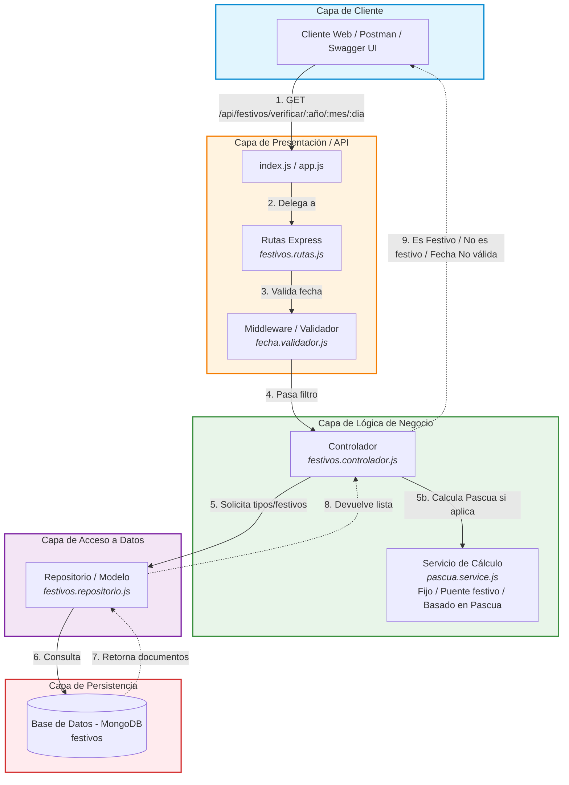

```mermaid
graph TD
    %% Cliente
    subgraph ClientLayer [Capa de Cliente]
        Client[Cliente Web / Postman / Swagger UI]
    end

    %% Presentación
    subgraph PresentationLayer [Capa de Presentación / API]
        Index[index.js / app.js]
        Routes[Rutas Express<br/><i>festivos.rutas.js</i>]
        Validators[Middleware / Validador<br/><i>fecha.validador.js</i>]
    end

    %% Negocio
    subgraph BusinessLayer [Capa de Lógica de Negocio]
        Controllers[Controlador<br/><i>festivos.controlador.js</i>]
        CalcService[Servicio de Cálculo<br/><i>pascua.service.js</i><br/>Fijo / Puente festivo / Basado en Pascua]
    end

    %% Acceso a datos
    subgraph DataAccessLayer [Capa de Acceso a Datos]
        Repositories[Repositorio / Modelo<br/><i>festivos.repositorio.js</i>]
    end

    %% Persistencia
    subgraph PersistenceLayer [Capa de Persistencia]
        DB[(Base de Datos - MongoDB<br/>festivos)]
    end

    %% Flujo de petición
    Client -->|1. GET /api/festivos/verificar/:año/:mes/:dia| Index
    Index -->|2. Delega a| Routes
    Routes -->|3. Valida fecha| Validators
    Validators -->|4. Pasa filtro| Controllers
    Controllers -->|5. Solicita tipos/festivos| Repositories
    Controllers -->|5b. Calcula Pascua si aplica| CalcService
    Repositories -->|6. Consulta| DB

    %% Flujo de respuesta
    DB -.->|7. Retorna documentos| Repositories
    Repositories -.->|8. Devuelve lista| Controllers
    Controllers -.->|9. Es Festivo / No es festivo / Fecha No válida| Client

    style ClientLayer fill:#e1f5fe,stroke:#0288d1,stroke-width:2px
    style PresentationLayer fill:#fff3e0,stroke:#f57c00,stroke-width:2px
    style BusinessLayer fill:#e8f5e9,stroke:#388e3c,stroke-width:2px
    style DataAccessLayer fill:#f3e5f5,stroke:#7b1fa2,stroke-width:2px
    style PersistenceLayer fill:#ffebee,stroke:#d32f2f,stroke-width:2px
```
