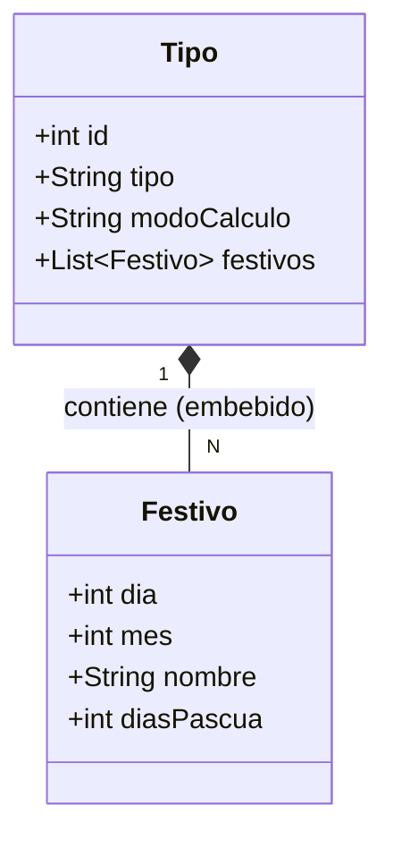

```mermaid
classDiagram
    class Tipo {
        +int id
        +String tipo
        +String modoCalculo
        +List~Festivo~ festivos
    }
    class Festivo {
        +int dia
        +int mes
        +String nombre
        +int diasPascua
    }
    Tipo "1" *-- "N" Festivo : contiene (embebido)
```
